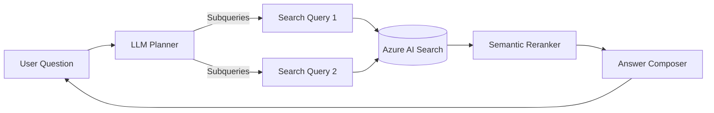
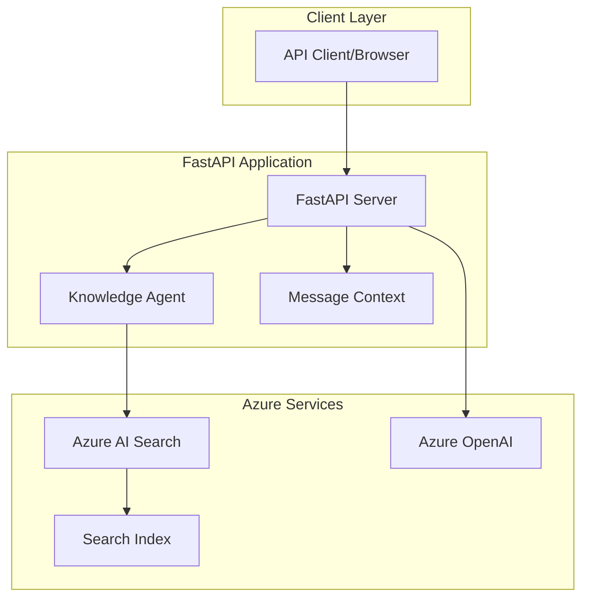
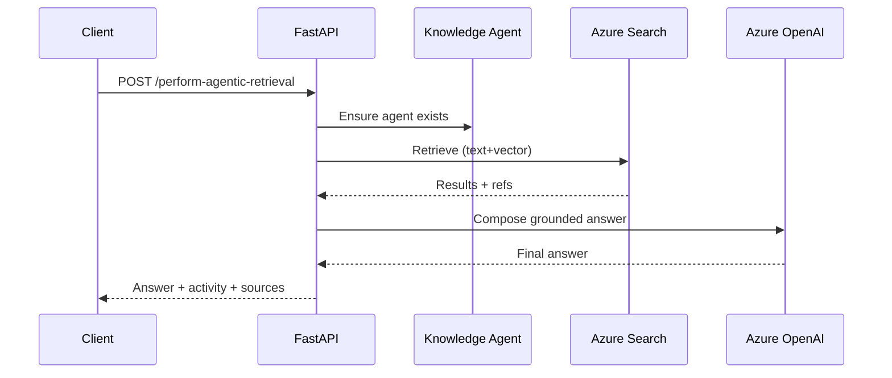
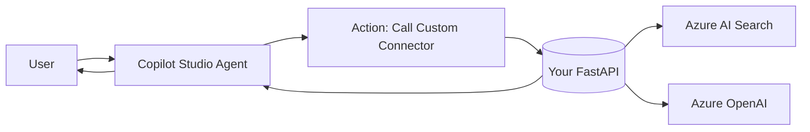

# Azure AI Agentic Retriever using AI Search: From Pro Code to Low Code

## Slide 1: Agentic Retrieval - Azure AI Search

**Presenter Notes:**

- **Welcome:** Introduce the session on bridging pro code and low code integrations.
- **Analogy:** Compare the process to transforming a complex recipe into a simple cooking guide.
- **Intro Presenters:** Briefly introduce yourselves and your areas of expertise.
- **Session Overview:** Highlight the focus on accessibility and integration of AI capabilities.
- **Engagement:** Encourage attendees to think about applying these concepts in their own projects.

---

## 1. Agenda
- Why agentic retrieval matters now
- Concept: how Azure AI Search agentic retrieval works
- Pro code: FastAPI service using Azure AI Search + Azure OpenAI
- Low code: Microsoft Copilot Studio agent calling the same API
- Demo & scenarios
- Best practices, pitfalls, and Q&A

---

## 2. Problem framing (relatable)
- Users ask complex, multi-part questions with missing context
- Traditional single-shot keyword/vector queries often miss nuance
- We need an “agent” that can plan, search iteratively, and cite sources

**Analogy**: Grocery delivery across multiple stores — you give a mixed list (produce, bakery, pharmacy). The planner decomposes the list into sublists (query planning), checks several stores at the same time for price/availability (parallel retrieval), then consolidates one grounded cart with receipts/links (synthesis with citations).

---

## 3. What is Agentic Retrieval (Azure AI Search)
- Multi-step, LLM-guided retrieval that:
  - Plans: decomposes a complex question into targeted sub-queries
  - Retrieves: runs parallel searches (keyword + vector) with semantic reranking
  - Synthesizes: composes a grounded response with citations
- Uses a persisted "knowledge agent" associated with your search index
- Conversation-aware: can leverage prior turns for follow-ups

**Diagram suggestion**: End-to-end flow


---

## 4. Architecture at a glance (this repo)
- Components:
  - FastAPI service (pro code) exposes `/perform-agentic-retrieval`
  - Azure AI Search index with text, vector, and semantic config
  - Azure OpenAI for embeddings + LLM planning/answering
  - Knowledge agent created once and reused across requests
- Returns: final answer, activity, and sources

**Mermaid (from README)**: Application + Azure services


---

## 5. Pro code: FastAPI implementation highlights
- Key capabilities
  - Lazy-init knowledge agent; reuse across calls
  - Request schema: user query + conversation context
  - Response: answer + search activity + references
- Environment config (from `readme.md`):
  - `AZURE_SEARCH_ENDPOINT`, `AZURE_SEARCH_KEY`, `INDEX_NAME`
  - `AZURE_OPENAI_*` (endpoint, keys, deployments, versions)
  - `AGENT_NAME`, `API_VERSION`

**Call flow**


**Live API Endpoints** (from repo):
- `POST /create-index` (create vector+semantic index)
- `POST /load-data` (load sample NASA data)
- `POST /perform-agentic-retrieval` (core)
- `DELETE /delete-knowledge-agent`, `DELETE /delete-search-index`

---

## 6. Low code: Microsoft Copilot Studio integration
- Goal: Use the same API via an action/custom connector so agents can call it
- Options:
  - Custom connector (Power Platform) using OpenAPI or manual definition
  - Built-in Actions in Copilot Studio to call external REST APIs
- Typical steps:
  1) Publish your FastAPI endpoint publicly or via secured gateway
  2) Define OpenAPI spec for `/perform-agentic-retrieval`
  3) Create custom connector (host, auth, action schema)
  4) Import/use connector in Copilot Studio and add an Action
  5) Author prompt/trigger to decide when to call the action
  6) Map response fields (answer, citations) into bot reply

**Integration flow**


---

## 7. Demo plan (split presenters)
- Part A (Pro code):
  - Start API
  - Call `POST /create-index`, `POST /load-data`
  - Run `POST /perform-agentic-retrieval` with 2-3 questions (follow-ups)
  - Show citations and activity in response
- Part B (Low code):
  - Show custom connector in Power Platform
  - In Copilot Studio, create Action bound to connector
  - Ask the same questions; show parity with pro code responses

**Demo checklist**
- Keys/config in `.env` valid; index name matches connector definition
- CORS enabled if calling from web
- Connector auth configured (API key header or gateway)
- Happy-path and edge-case prompts prepared

---

## 8. Best practices & pitfalls
- Best practices
  - Grounding: ensure documents are chunked and well-labeled for reranking
  - Balance: combine text + vector; tune `k` and filters
  - Observability: log subqueries and sources; store conversation state
  - Security: store secrets in Key Vault; least-privileged keys/MI
  - Lifecycle: version your index; plan for re-embedding
- Pitfalls
  - Overlong prompts without guardrails
  - Missing semantic config harms results
  - Connector timeouts due to large payloads
  - Non-deterministic answers without grounding

---

## 9. Metrics that matter
- Retrieval quality: success@k, citation coverage, groundedness
- Experience: latency (P50/P95), action success rate
- Ops: cost per request, token usage

---

## 10. When to use Pro code vs Low code
- Pro code
  - Need custom logic, policies, orchestration, or SLAs
  - Complex pipelines, A/B testing, specialized ranking
- Low code
  - Rapid prototyping; business-owner customization
  - Channel integrations (Teams, websites) with minimal engineering

---

## 11. Resources
- Azure AI Search Agentic Retrieval (concepts, Python quickstart)
  - learn: `https://learn.microsoft.com/en-us/azure/search/search-get-started-agentic-retrieval?pivots=programming-language-python`
- Microsoft Copilot Studio (actions, connectors)
  - docs: `https://learn.microsoft.com/en-us/microsoft-copilot-studio/actions-overview`
  - connectors: `https://learn.microsoft.com/en-us/connectors/custom-connectors/define-openapi-definition`
- This repo
  - `README.md` for endpoints, env, flows

---

## 12. Q&A
- Ask us about: evaluation strategies, cost controls, vector sizes, auth models, channel deployment

---

## 13. Appendix (optional slides)
- OpenAPI snippet for the connector action
```yaml
openapi: 3.0.1
info:
  title: Agentic Retrieval API
  version: 1.0.0
paths:
  /perform-agentic-retrieval:
    post:
      summary: Conversational search with agentic retrieval
      requestBody:
        required: true
        content:
          application/json:
            schema:
              type: object
              properties:
                query:
                  type: string
      responses:
        '200':
          description: OK
```

- Example copilot action instruction
> "When the user asks a complex question about our knowledge base, call the Agentic Retrieval action with their question. Return the `answer` and list the `sources` as bullet points."

## Slide 3: RAG - Retrieval Augmented Generation

**Presenter Notes:**

- **Concept Overview:** Explain RAG as a method that combines search with language models to enhance responses.
- **User Question:** Start with a user query that needs detailed information.
- **Search Process:** Describe how the system searches documents to find relevant data.
- **Language Model:** Explain how the language model synthesizes the search results into a coherent answer.
- **Analogy:** Think of RAG as a librarian (search) and a storyteller (language model) working together to provide a complete answer.

---

## Slide 5: What is Agentic Retrieval?

**Presenter Notes:**

- **Introduction:** Explain Agentic Retrieval as a multi-step, LLM-guided process.
- **Planning:** Describe how it breaks down complex questions into sub-queries.
- **Retrieval:** Highlight the use of parallel searches with semantic reranking.
- **Synthesis:** Explain how it composes responses with citations for credibility.
- **Knowledge Agent:** Mention the use of a persistent agent linked to the search index.
- **Conversation-Aware:** Emphasize its ability to use previous interactions for context.

---


