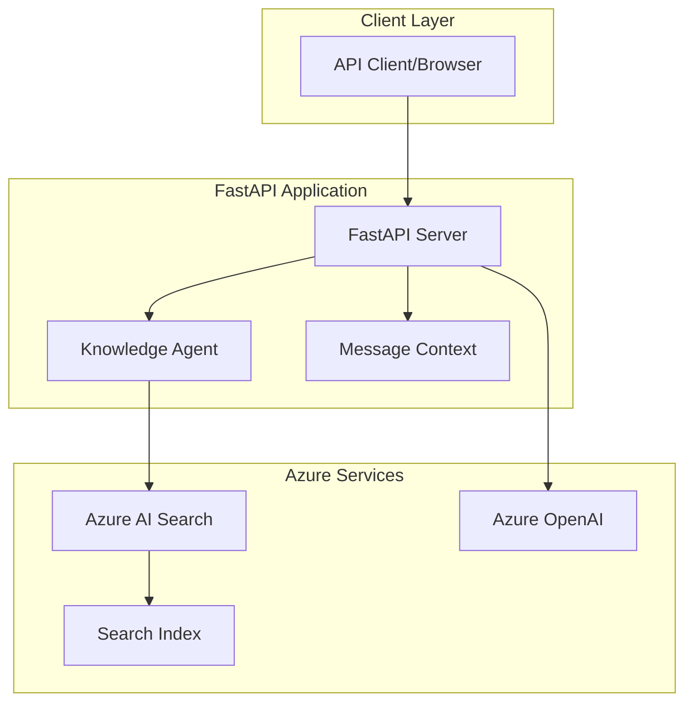
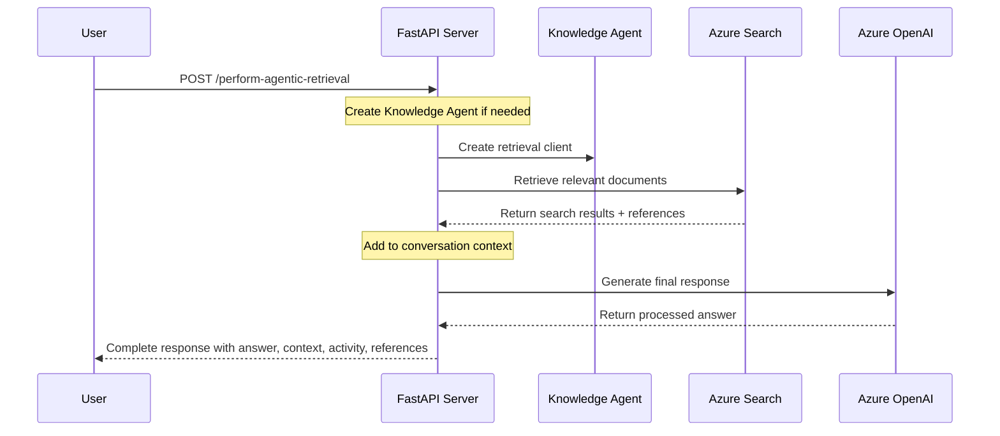
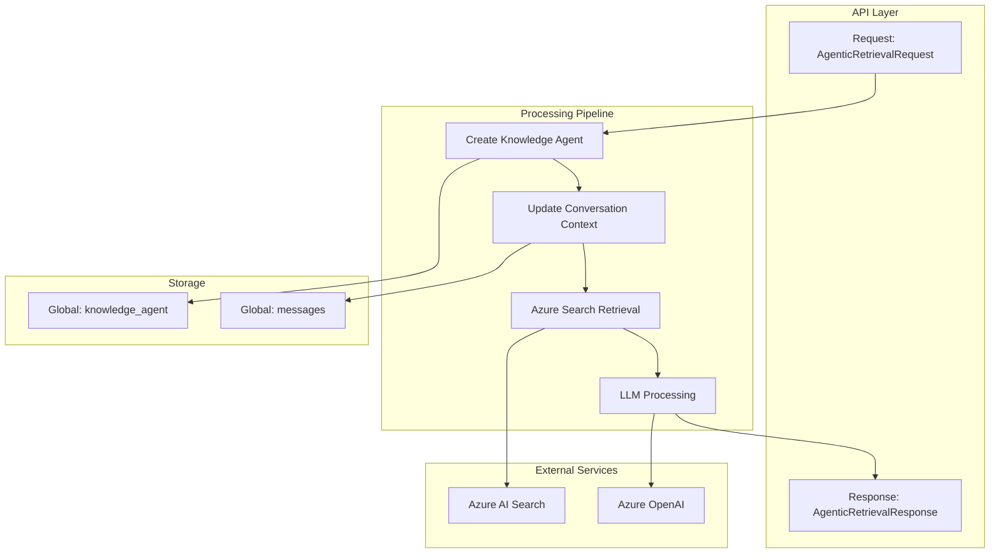

# Agentic Search API with Azure AI Search

A FastAPI-based implementation of Azure AI Search's Agentic Retrieval system that provides conversational search capabilities with knowledge agents.

## Features

- **Conversational Search**: Remembers previous questions and answers for natural back-and-forth conversations
- **Knowledge Agents**: Uses Azure AI Search agents to find and retrieve relevant information
- **Vector Search**: Finds semantically similar content using Azure OpenAI embeddings
- **RESTful API**: Simple FastAPI setup with built-in documentation
- **Smart Resource Management**: Knowledge agents are created once and reused, as they become permanently associated with your search index
- **Complete Responses**: Returns the answer plus search activity and source documents

## Architecture Overview



## Functional Flow



## Quick Start

### Prerequisites

- Azure AI Search service
- Azure OpenAI service (or Azure AI Foundry project)
- Python 3.8+

**⚠️ Important Azure Setup Requirements:**
- Create Azure AI Search service and Foundry project in the same resource group
- **Enable system-assigned managed identity** for the Azure AI Search service
- **Assign "Cognitive Services User" role** to the search service's managed identity on the Azure AI Foundry project
- Without these permissions, Knowledge Agents will fail with authentication errors

### Setup

1. **Clone the repository**
   ```bash
   git clone <repository-url>
   cd ai-search-agentic-retriever
   ```

2. **Install dependencies**
   ```bash
   pip install -r requirements.txt
   ```

3. **Configure environment variables**
   Create a `.env` file with:
   ```env
   AZURE_SEARCH_ENDPOINT=https://your-search-service.search.windows.net
   AZURE_SEARCH_KEY=your-search-key
   AZURE_OPENAI_ENDPOINT=https://your-openai.openai.azure.com
   AZURE_OPENAI_API_KEY=your-openai-key
   AZURE_OPENAI_GPT_DEPLOYMENT=your-gpt-deployment
   AZURE_OPENAI_GPT_MODEL=gpt-4
   AZURE_OPENAI_EMBEDDING_DEPLOYMENT=your-embedding-deployment
   AZURE_OPENAI_EMBEDDING_MODEL=text-embedding-ada-002
   AZURE_OPENAI_API_VERSION=2024-02-01
   INDEX_NAME=your-index-name
   AGENT_NAME=your-agent-name
   ANSWER_MODEL=your-answer-model
   API_VERSION=2024-11-01-preview
   MAX_CONVERSATION_HISTORY=1
   ```

4. **Load custom data (optional)**
   ```bash
   # Use the data loader utility to ingest your own CSV data
   python load_csv_data.py
   ```

5. **Run the API server**
   ```bash
   python api_agentic_retrieval.py
   ```

6. **Access the API**
   - API: http://localhost:8000
   - Swagger UI: http://localhost:8000/docs
   - ReDoc: http://localhost:8000/redoc

## API Endpoints

### Setup & Management

| Method | Endpoint | Description |
|--------|----------|-------------|
| `POST` | `/create-index` | Creates the Azure Search index with vector and semantic search |
| `POST` | `/load-data` | Loads sample NASA Earth at Night data into the index |
| `DELETE` | `/delete-knowledge-agent` | Deletes the knowledge agent and resets conversation |
| `DELETE` | `/delete-search-index` | Deletes the search index and all data |
| `GET` | `/health` | Health check endpoint |

### Core Functionality

| Method | Endpoint | Description |
|--------|----------|-------------|
| `POST` | `/perform-agentic-retrieval` | Performs conversational search with automatic knowledge agent initialization |

**API Documentation**: Complete request/response schemas and interactive testing available at `/docs`

## Technical Details

### Data Flow Architecture



### Key Components

- **Knowledge Agent**: Azure AI Search agent set up with GPT models and your search index. Once created, it stays linked to the index and handles all future requests
- **Conversation Context**: Keeps track of the entire conversation history for follow-up questions
- **Vector Search**: Uses Azure OpenAI embeddings to find content by meaning, not just keywords
- **Automatic Setup**: Knowledge agents are created on the first API call and then reused

**Note**: Knowledge agents are not currently visible or manageable through the Azure Portal. Management and deletion must be done programmatically using the API endpoints provided. Portal support may be added in future Azure updates.

### Configuration

The API uses environment variables for configuration:

- **Index Configuration**: Vector search with HNSW algorithm and semantic search
- **Knowledge Agent**: Set with reranker threshold of 2.0
- **Conversation Memory**: Configurable history limit via `MAX_CONVERSATION_HISTORY` (default: 1)
- **Error Handling**: Clear error messages with proper HTTP status codes

### Data Loading Utilities

The project includes a `load_csv_data.py` utility for ingesting custom data:

- **Flexible CSV Processing**: Reads multiple CSV files and converts them to search documents
- **Automatic Embedding Generation**: Uses Azure OpenAI to create embeddings for each record
- **Configurable Processing**: Processes one CSV at a time with progress tracking
- **Generic Architecture**: Can be adapted for different data schemas and formats

## Development

### Running Tests
```bash
# Test individual endpoints
curl -X POST "http://localhost:8000/create-index"
curl -X POST "http://localhost:8000/load-data"
curl -X POST "http://localhost:8000/perform-agentic-retrieval" \
  -H "Content-Type: application/json" \
  -d '{"query": "What is urban lighting?"}'
```

## Azure Authentication Notes

- This project uses key-based authentication for the search service and OpenAI service for simplicity
- The managed identity setup (documented in Prerequisites) is required for Knowledge Agent functionality only

## References

- [Azure AI Search Agentic Retrieval Documentation](https://learn.microsoft.com/en-us/azure/search/search-get-started-agentic-retrieval?pivots=programming-language-python)
- [FastAPI Documentation](https://fastapi.tiangolo.com/)
- [Azure OpenAI Service](https://azure.microsoft.com/en-us/products/ai-services/openai-service)
